# PRÁCTICAS DWES
## Alejandro Vaquero Abad

---

### ÍNDICE
- [Actividad 1](#actividad-1)
- [Actividad 2](#actividad-2)
- [Actividad 3](#actividad-3)
- [Actividad 4](#actividad-4)

---

### Actividad 1
**Objetivo: Instalar y configurar un paquete software que integre Apache, PHP y MSQL.**

Como se aprecia en las capturas el XAMPP está activo y funcional en el equipo, phpmyadmin es accesible y la web de pruebas también

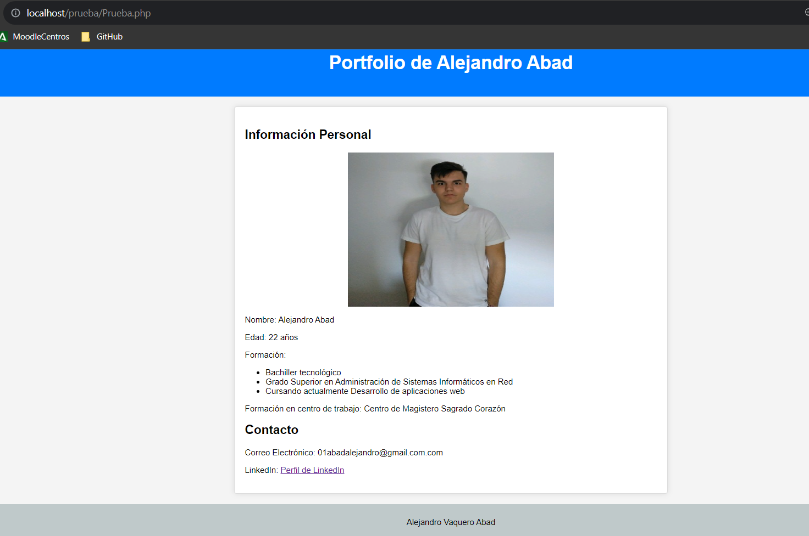

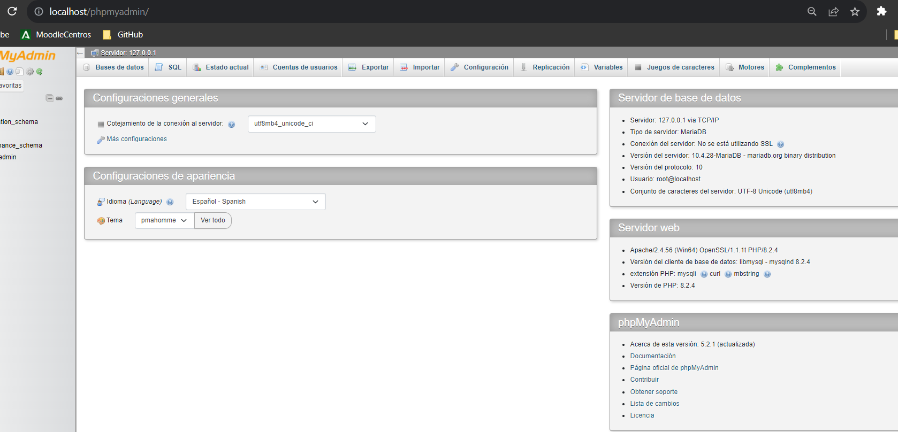

### Actividad 2
**Objetivo: Instalación y configuración de un entorno web utilizando una máquina virtual.**

Primero updateamos todos los paquetes del servidor para obtener las versiones correctas de los programas a usar.

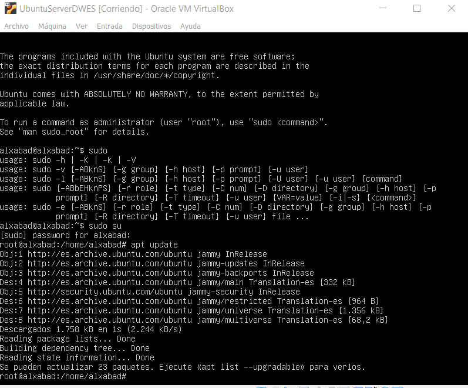

Posteriormente instalamos los paquetes necesarios

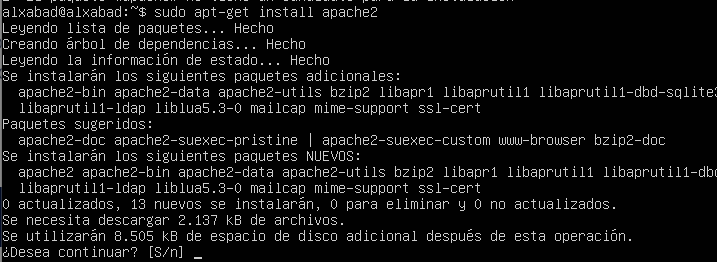
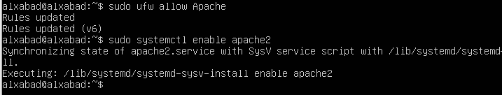

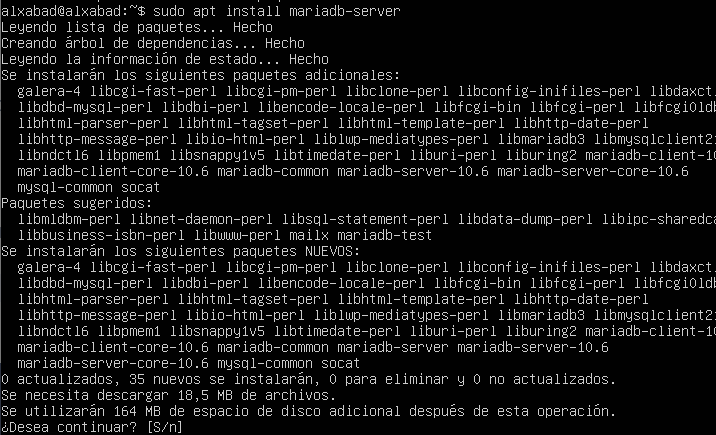
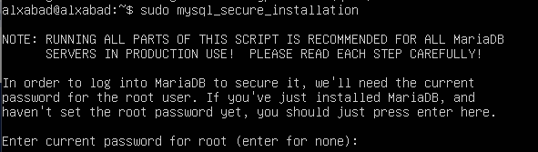

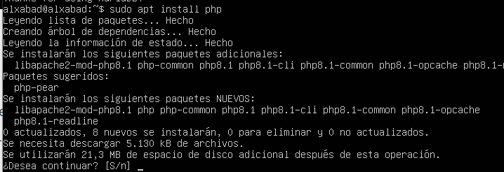
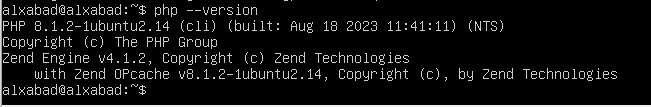

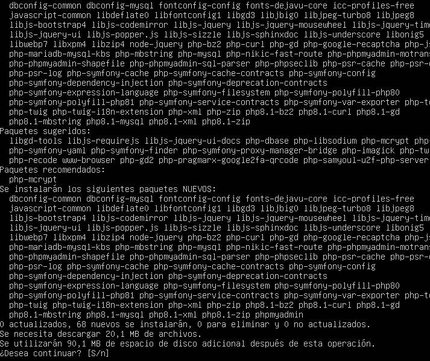

Una vez tenemos todos los paquetes instalados, accederemos mediante un plugin de ssh de visual studio a la máquina, y habilitamos permisos de uso a la carpeta donde trabajaremos

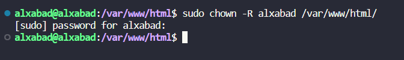
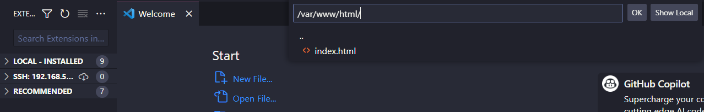
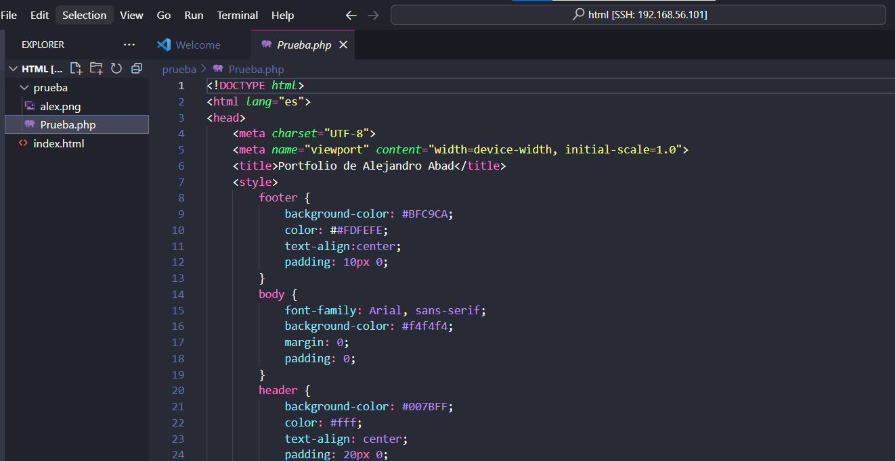

Posteriormente vemos la ip del servidor y accedemos a ella desde nuestro equipo

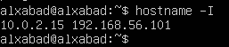
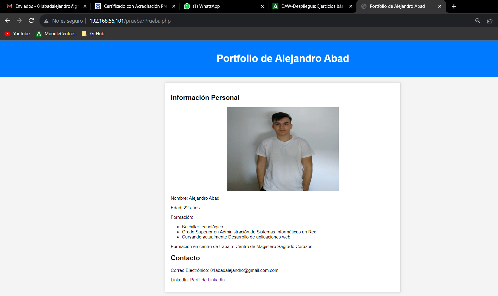

Comprobamos que todos los servicios están instalados y activos

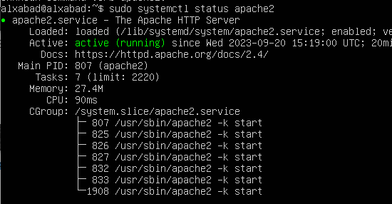
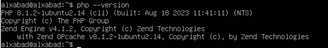
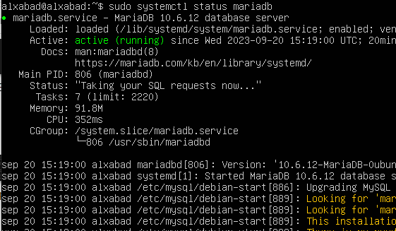
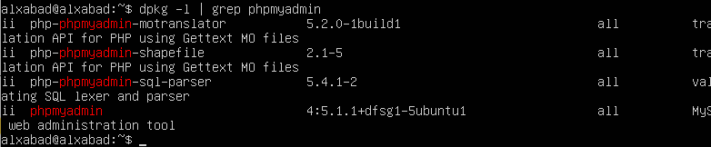

### Actividad 3
**Objetivo: Instalación y configuración de un entorno web utilizando una máquina virtual.**

Instalamos Vagrant

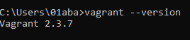

Usamos el comando vagran box add laravel/homestead y elegimos la opción 3 (virtualbox)

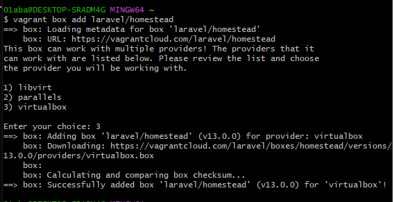
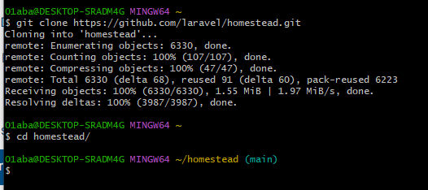

Iniciamos el docker

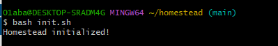

Le habilitamos el servicio ssh

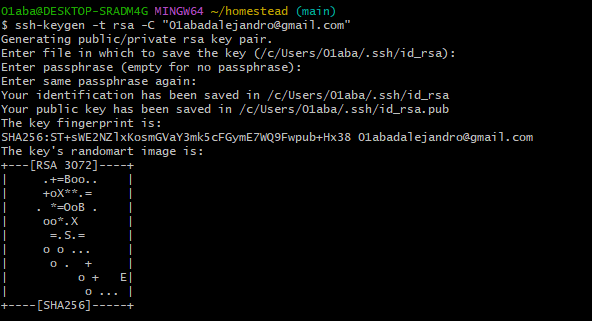

Modificamos el fichero "homestead.yml" situado en la carpeta donde lo instalamos

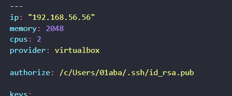

Levantamos el vagrant

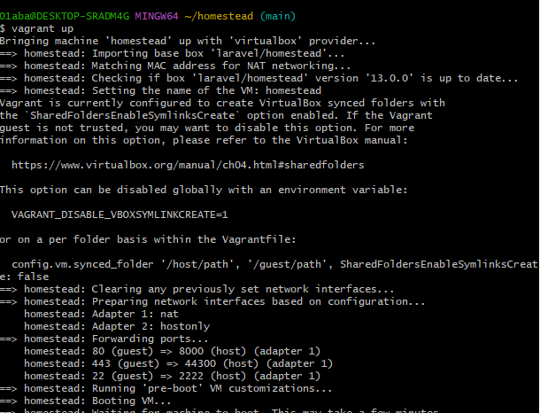

Modificamos el fichero hosts

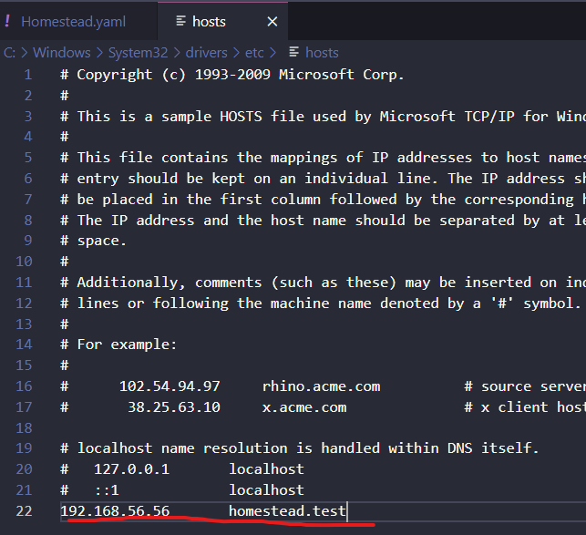

Nos conectamos por ssh

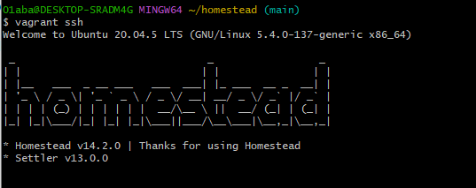

Accedemos a la carpeta home/vagrant/code/public que es donde debemos almacenar los fichero que queremos acceder y generamos un codigo .html

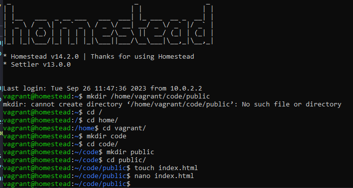

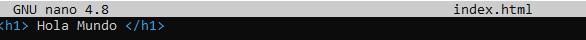

Accedemos a la dirección "homestead.test" (que configuramos en el fichero hosts del sistema) y podemos ver que la web ya es accesible

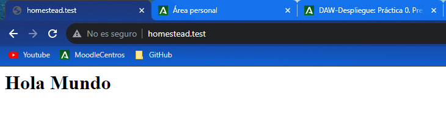

### Actividad 4
**Objetivo: Crear un entorno virtual para desarrollo en el lado del servidor.**

Accedemos al Eclipse, seleccionaremos preferencias, y añadir un entorno de runtime

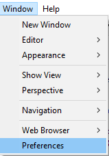

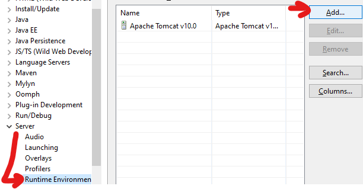

Seleccionamos el servidor apache tomcat y elegiremos la opción "Create a new local server"

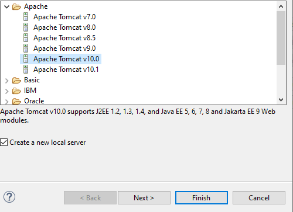

Ahora creamos un proyecto de web dinamico y dentro de este crearemos un "JSP file", posteriormente crearemos un servlet

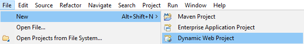

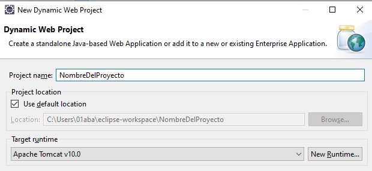

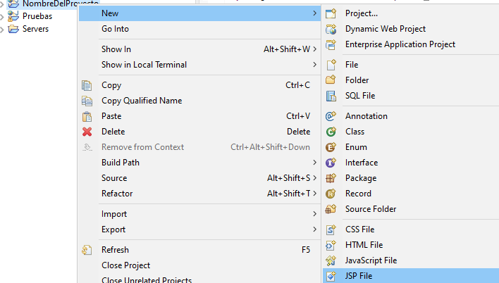

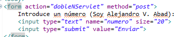

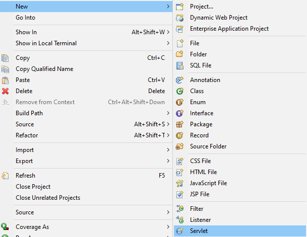

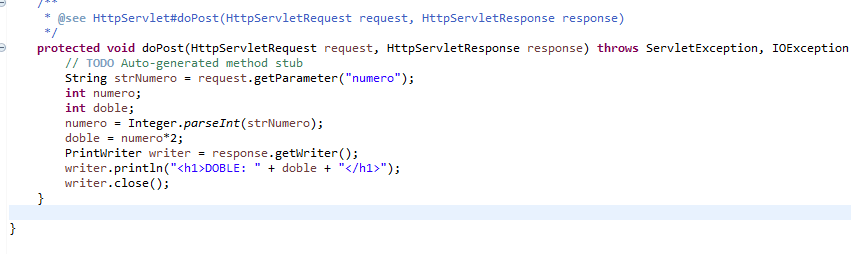

Le daremos run as >> run on server, seleccionaremos el servidor tomcat de apache que anteriormente habíamos configurado y podremos acceder

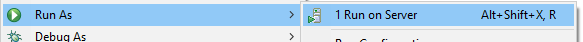

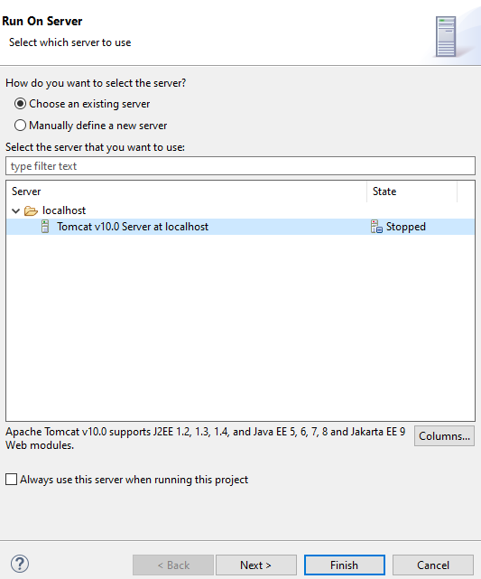

Accedemos al proyecto en la red, pondremos el número 3 para probar, le daremos a enviar y vemos como nos enseña el doble de ese número

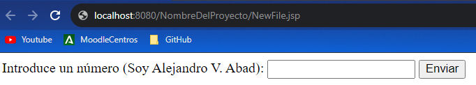

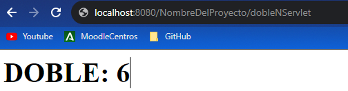
